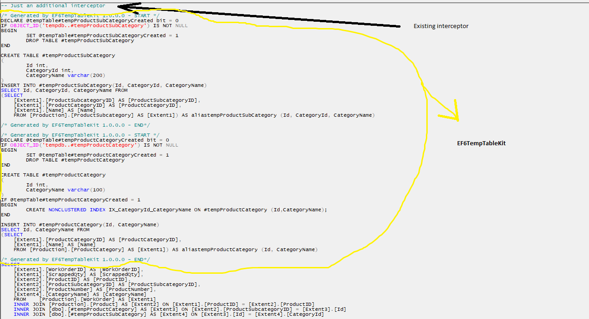

# EF6TempTableKit - version 2.0.0
EF6TempTableKit is a library that helps you utilize temp tables in your Entity Framework 6 context mapped to Microsoft SQL Server database.

[](https://github.com/zblago/EF6TempTableKit/releases) 
[](https://ci.appveyor.com/project/zblago/ef6temptablekit)
[](https://ci.appveyor.com/project/zblago/ef6temptablekit/build/tests)
[](https://www.nuget.org/packages/EF6TempTableKit/)

## Versions
1.0.0 - check for details [here](https://github.com/zblago/EF6TempTableKit/tree/EF6TempTableKit_version_1_0_0)

## Overview

In some cases, when you write LINQ-to-Entities(L2E) queries, you would like to have a benefit like temp tables (e.g. create and insert records in temporary tables and later on reusing them as much as you want in a query). By default, EF doesn't support temporary tables and there is a reason why is like that. To overcome this "weakness", introducing EF6TempTableKit in your project, you can add a "temporary" entity as we are used to do it with "permanent" entitiy. In generated T-SQL query, "temporary" entity will be mapped to a temporary table which resides in `tempDb` database and used normally like any other table.<br/>
Keep in mind: You are still writing LINQ-to-Entities to insert records in a "temporary" entity.

## What is changed in version 2.0.0

Version 2.0.0 has some improvements such as:
- support for multiple temporary tables
- columns order in a nonclustered index
- injecting into final query only needed DDL and DML queries and their related dependencies
- more tests in solution

## Getting Started

Follow these steps:
1. Install Nuget package (`Install-Package EF6TempTableKit -Version 2.0.0`)
2. Implement `IDbContextWithTempTable` within your context. What does that mean? Add a public property and initialize it via constructor or auto-property initializer
```csharp
  public TempTableContainer TempTableContainer { get; set; } = new TempTableContainer();
```
3. Add a "temporary" entity and a DTO entity which inherits the previouse one. You need a both of them to make it work.
Ensure unique temporary table name that starts with # and has implemented marker interface `ITempTable`. Also, add  a sufix `TempTable` to make it unique and easy to distinguish it later in a code. For each field, set appropiate SQL Server data type that will be used throughout table creation. 
```csharp
  [Table("#tempAddress")]
  public class AddressTempTable : ITempTable
  {
      [TempFieldTypeAttribute("int")]
      public int Id { get; set; }
      
      [TempFieldTypeAttribute("varchar(200)")]
      public string AddressLine { get; set; }
  }

  [NotMapped]
  public class AddressTempTableDto : AddressTempTable
  {
  }
```
4. Add a "temporary" entity on a context 

```csharp
  public virtual DbSet<AddressTempTable> AddressesTempTable { get; set; }
```
5. Apply a configuration on a context.
```csharp
    [DbConfigurationType(typeof(EF6TempTableKitDbConfiguration))]
    public partial class AdventureWorksCodeFirst : DbContext, IDbContextWithTempTable
    ...
    ...    
```
If you don't have already any configuration, use `EF6TempTableKitDbConfiguration`. Otherwise, apply your own custom configuration ...
```csharp
    [DbConfigurationType(typeof(CustomDbContextConfiguration))]
    public partial class AdventureWorksCodeFirst : DbContext, IDbContextWithTempTable
````
 ... but be sure that you have injected `EF6TempTableKitQueryInterceptor` interceptor.
````csharp
    public class CustomDbContextConfiguration : DbConfiguration
    {
        public CustomDbContextConfiguration()
        {
            AddInterceptor(new AdventureWorkQueryInterceptor());
            AddInterceptor(new EF6TempTableKitQueryInterceptor());
        }
    }
````
6. Write a query
```csharp
  using (var context = new AdventureWorksCodeFirst())
  {
      //Be sure that result is mapped into DTO object
      var tempAddressQuery = context.Addresses.Select(a => new AddressTempTableDto { Id = a.AddressID, Name = a.AddressLine1 });

      var addressList = context
              .WithTempTableExpression<AdventureWorksCodeFirst>(tempAddressQuery)
              .AddressesTempTable.Join(context.Addresses,
              (a) => a.Id,
              (aa) => aa.AddressID,
              (at, a) => new { Id = at.Id }).ToList();                
  }
```
7. Run a code.

## Documentation

EF6TempTableKit supports some features like reusing existing table within the same connection([SPID](https://docs.microsoft.com/en-us/sql/t-sql/functions/spid-transact-sql?view=sql-server-ver15)), clustered index and non-clustered indexes. Here is a short documentation:

| Extension       | Description |
| --------------- |-------------|
| `WithTempTableExpression` | Extension that accepts an expression being translated into T-SQL query that has a logic for inserting records in temp table. `WithTempTableExpression<T>(this System.Data.Entity.DbContext dbContexWithTempTable, IQueryable<ITempTable> expression, bool reuseExisting = false)` supports reusing existing temp table within the same [SPID](https://docs.microsoft.com/en-us/sql/t-sql/functions/spid-transact-sql?view=sql-server-ver15). If you set `reuseExisting` flag on `true`, generated T-SQL will check whether temp table already exists or not. That means, if you run mutliple queries within the same connection, you can reuse created temp table as temp table is scoped in SPID in which is created. **Important - You can attach an expression that requires for its creation some other expression(s). In that case, you have to take care of an order in which expressions are being been attached in a way that first are coming expressions that have a little or no dependencies to those that have dependencies on previously attached expressions. Regularly, in T-SQL you will do the same. At the top of T-SQL query, we are declaring and inserting data into tables that are used down there in code for some other temporary tables. The same logic is applied here, but it is on a developer to keep an eye on expression order. **|
| `ReinitializeTempTableContainer` | Clears out the attached expressions. When you run a query in a loop, second iteration will throw an exception `Can't override query for temp table {tempTableName} as it is already attached to the context."`. In that case and for every subsuqent call ensure that temp tables will be generated again with a new data specific for that iteration. |

| Attribute       | Description |
| --------------- |-------------|
| `ClusteredIndex` | Associate this attribute with a field(s) you want in clustered index. |
| `NonClusteredIndex("indexName, [orderNo = 0]")` | Associate this attribute with a field(s) you want in non-clustered index. Number of non-clustered index is limited by SQL Server. If you want more columns within the same non-clustered index, just add a same name. You can set order of the columns by using `orderNo` parameter. |
| `TempFieldTypeAttribute` | Use this attribute to define field data type in a SQL Server manner. E.g. `([TempFieldTypeAttribute("varchar(200)")])`. |

## How it works

Before brief explanation of how EF6TempTableKit does his work keep in mind that **EF6TempTableKit doesn't affect EF6 default behaviour at all**. So, how it works? It uses EF6 ability to intercept a generated query before it hits a DB. But, before that, it does some digging through the internal/hidden EF6 properties and fields to get needed metadata (e.g. column order) and raw query. Using those informations it builds DML and DDL queries. When code execution goes through the attached `EF6TempTableKitQueryInterceptor` interceptor, previously attached queries are being attached at the begining of the intercepted query.

This code represents importance of an order in which expressions are attached. Expressions with no or little dependencies are coming first, those with dependencies are coming afterward.

```csharp
    ....
    context.WithTempTableExpression<AdventureWorksCodeFirst>(queryModel.TempOfficeTypeQuery);
    context.WithTempTableExpression<AdventureWorksCodeFirst>(queryModel.TempAddressQuery);
    context.WithTempTableExpression<AdventureWorksCodeFirst>(queryModel.TempManufacturerQuery);
    context.WithTempTableExpression<AdventureWorksCodeFirst>(queryModel.TempPartTypeQuery);
    context.WithTempTableExpression<AdventureWorksCodeFirst>(queryModel.TempPartQuery);
    context.WithTempTableExpression<AdventureWorksCodeFirst>(queryModel.TempChairQuery);
    context.WithTempTableExpression<AdventureWorksCodeFirst>(queryModel.TempRoomQuery);
    context.WithTempTableExpression<AdventureWorksCodeFirst>(queryModel.TempPersonQuery);
    context.WithTempTableExpression<AdventureWorksCodeFirst>(queryModel.TempDepartmentQuery);
    context.WithTempTableExpression<AdventureWorksCodeFirst>(queryModel.TempOfficeQuery);
    
    var tempAddress = context.TempAddresses.Take(1).FirstOrDefault();
```
Final T-SQL query will be made of only query against TempAddress temp table regardless of how many expressions are in TempTableContainer. 



## Known issues

EF6TempTableKit has been implemented on enterprise project which has VS solution with more than 15 projects, where base context is inherited on multiple levels, where DBContext has DbConfiguration in a different project, etc... <br/>In such a bit complicated scenario, ony one exception occured that was not explicity related to E6TempTableKit. It was about how to apply custom configuration on your `DbContext`.<br/>So, If you get exception like this:<br/>

*The default DbConfiguration instance was used by the Entity Framework before the 'DbConfig' type was discovered. An instance of 'DbConfig' must be set at application start before using any Entity Framework features or must be registered in the application's config file. See http://go.microsoft.com/fwlink/?LinkId=260883*

just follow solution from [here](https://docs.microsoft.com/hr-hr/ef/ef6/fundamentals/configuring/code-based?redirectedfrom=MSDN)
or [here](https://stackoverflow.com/questions/19929282/ef6-modelconfiguration-set-but-not-discovered)

In my case, the following code was enough:<br/>
`<entityFramework codeConfigurationType="MyNamespace.MyDbConfiguration, MyAssembly">
    ...Your EF config...
</entityFramework>`

In addition to that, if you are getting the following exception:

*One or more validation errors were detected during model generation:
EF6TempTableKit.Test.CodeFirst.ProductCategoryCountTempTable: : EntityType 'ProductCategoryCountTempTable' has no key defined. Define the key for this EntityType.
ProductCategoryCountTempTables: EntityType: EntitySet 'ProductCategoryCountTempTables' is based on type 'ProductCategoryCountTempTable' that has no keys defined.
Also, that's the case when we don't have Id field (CategoryId - throws exception, if we rename it to Id- it works)*

Ensure that your "temporary" entity has ID field (`public int ID {get; set;}`) or `[Key]` attribute associated with a column that represents ID.

If you are mapping the same field twice or more into DTO entity, like here (a.AddressID) <br/>
```csharp
var tempAddressQuery = context.Addresses.Select(a => new AddressTempTableMultipleIdDto
{
    //AddressID is mapped twice; EF throws exception
    Id = a.AddressID,
    Id2 = a.AddressID,
    Name = a.AddressLine1
});

var addressList = context
        .WithTempTableExpression<AdventureWorksCodeFirst>(tempAddressQuery)
        .TempAddressesMultipleId.Join(context.Addresses,
        (a) => a.Id,
        (aa) => aa.AddressID,
        (at, a) => new { Id = at.Id }).ToList();
}
```
you may get an exception like *SqlException: 'tempTableName' has fewer columns than were specified in the column list*. In that case ensure that is mapped only once. Later on, if you need to map it again, do that on materialized data (in memory). This case is also covered in test project.

## (S)o(l)utio(n) file & how to run it

Solution has a source code and tests that covers all features from Documentation section.

After downloading source code, you can run and debug provided tests. Also, here is a simple Web application. It has almost nothing. The idea is to show how to write and run integration test.<br/>
Before you run test project, be sure that you have executed DB script from database folder:
1. Navigate to `...\EF6TempTableKit\database\oltp-install-script`
2. Open `instawdb.sql` in SQL Server Management Studio
3. Enable [SQLCMD Mode](https://www.sqlshack.com/use-sqlcmd-commands-ssms-query-editor/)
4. This variable should point on directory where you downloaded this project
`:setvar SqlSamplesSourceDataPath "C:\Projects\EF6TempTableKit\DBScript\oltp-install-script\"`<br/>
5. Run a script

### Running tests

Test project is based on [xunit](https://xunit.net/) testing framework. In order to run test project, just follow these [steps](https://xunit.net/docs/getting-started/netfx/visual-studio). Before you run test project, make sure that you have changed connection strings.

## Installation Prerequisites
- EF6TempTableKit is built under [.NET Framework 4.5](https://www.microsoft.com/en-us/download/details.aspx?id=30653)

Projects listed below are built under [.NET Framework 4.6](https://www.microsoft.com/en-us/download/details.aspx?id=48130) <br/>
- EF6TempTableKit.Test
- EF6TempTableKit.Test.Web

## Final word
You might find this library useful for you. However, this library is not tested for insert, delete and update scenarios. It's on you to test whether it works or not.

## Authors

[**Zoran Blagojevic**](https://www.linkedin.com/in/zoran-blagojevic/)

## License

This project is licensed under the MIT License - see the [LICENSE.md](LICENSE) file for details

## Acknowledgments

Hat tip to guys who made some useful things used here:
* https://www.stevefenton.co.uk/2015/07/getting-the-sql-query-from-an-entity-framework-iqueryable/
* http://www.davidberube.me/getting-the-sql-generated-by-entity-framework-queryable/
* https://www.tpeczek.com/2016/10/entity-framework-6-dynamically-creating_13.html
